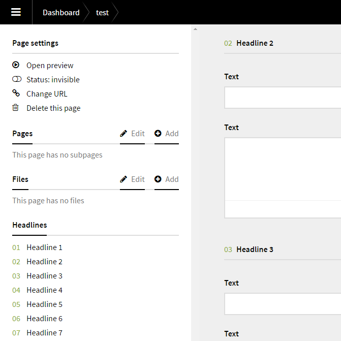

# Kirby Headline Jump

 [](https://www.paypal.me/DevoneraAB)

Field which makes it possible to jump between Kirby Panel headline groups.

## Background

### Problems with accordions / tabs

I've used accordions and tabs fields/plugins many times. They make a great overview, but they also hide stuff. In some cases it means that fields can be hard to find.

### Problems with the built in `headline` field

The built in `headline` field is good, it doesn't hide anything, but I miss the overview from the accordions and tabs fields/plugins.

I wanted a combination of them. Show everything, but with a good overview. This plugin creates an index of the headlines. Just click on one of them to go to a headline group.

**In the screenshot below I've clicked "Headline 2":**



## Installation

Use one of the alternatives below.

### 1. Kirby CLI

If you are using the [Kirby CLI](https://github.com/getkirby/cli) you can install this plugin by running the following commands in your shell:

```
$ cd path/to/kirby
$ kirby plugin:install jenstornell/kirby-headline-jump
```

### 2. Clone or download

1. [Clone](https://github.com/jenstornell/kirby-headline-jump.git) or [download](https://github.com/jenstornell/kirby-headline-jump/archive/master.zip)  this repository.
2. Unzip the archive if needed and rename the folder to `kirby-headline-jump`.

**Make sure that the plugin folder structure looks like this:**

```
site/plugins/kirby-headline-jump/
```

### 3. Git Submodule

If you know your way around Git, you can download this plugin as a submodule:

```
$ cd path/to/kirby
$ git submodule add https://github.com/jenstornell/kirby-headline-jump site/plugins/kirby-headline-jump
```

## Setup

### Blueprint

To make it work as expected, add the following code to your blueprint:

```
fields:
  headlinejump: headlinejump
```

To make it work, you need [headlines](https://getkirby.com/docs/cheatsheet/panel-fields/headline) in your blueprint.

## Usage

- Click the headlines in the sidebar to jump to a headline group.
- Click the headlines sidebar title "Headlines" to go to the top. 

## Changelog

**0.3**

- Bugfix - Site option headline jump now works as expected.
- Bugfix - This plugin in combination with the image field drag and drop did not work. Now it does.

**0.2**

- Removed padding hack
- Added global field definition

**0.1**

- Initial release

## Requirements

- [**Kirby**](https://getkirby.com/) 2.4.1+

## Disclaimer

This plugin is provided "as is" with no guarantee. Use it at your own risk and always test it yourself before using it in a production environment. If you find any issues, please [create a new issue](https://github.com/jenstornell/kirby-headline-jump/issues/new).

## License

[MIT](https://opensource.org/licenses/MIT)

## Credits

- [Jens Törnell](https://github.com/jenstornell)